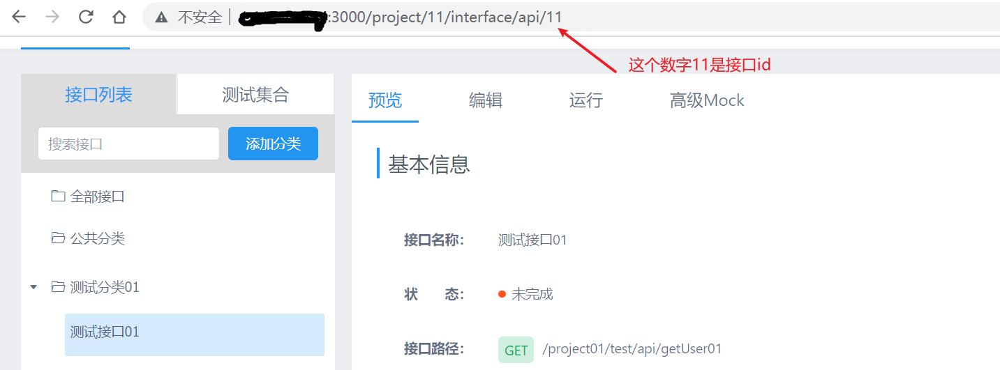

#### 一、简介

##### 1. 这是什么

这是一个`Java`代码生成器。

##### 2. 有啥用

能把`Yapi`上定义的接口生成可执行的`Java`代码，包括`controler`、`service`、`entity`等类文件，一键生成，方便快捷。

`Yapi`上的接口定义


生成的`Java`代码，有完整的类结构、方法、参数、变量等等，可直接使用


##### 3. 为什么要用

`Yapi`上定义好接口之后，转换成`Java`代码时费时费力，都是重复劳动，毫无意义，所以有了这个工具把程序员从大量重复劳动中解放出来。

#### 二、快速开始

##### 1.下载

1）下载发布版本

最新版本：xxx

将`yaorongke-yapi-generator-1.0.0.zip`解压到一个文件夹里，包含一个`jar`和一个配置文件


2）源码编译打包

```shell
# clone本项目源码
git clone xxx
# 编译打包，jar包输出到target目录下
mvn clean package -Dmaven.test.skip=true
```

##### 2.配置

修改`application.properties`，所有配置如下所示，前4项为`yapi`服务相关配置，请按实际情况填写；后4项为要生成的类文件的个性化配置，选填。`yapi.api.interface.ids`和`yapi.api.cat.id`只配置一个即可，两个都配置时会把包含的接口`id`合并。

```properties
# yapi服务地址
yapi.url=http://1.116.42.251:3000
# 每个项目都有唯一的标识token，用户可以使用这个token值来请求项目 openapi.
yapi.project.token=bb70d7d0d1511baa7873fb515398a7b935add6e3575s5d79e8c62805afb3b91f
# 需要生成Java代码的接口id，多个接口id时逗号隔开
yapi.api.interface.ids=11
# 需要生成Java代码的分类id，只支持单个分类id，配置该项会获取分类下的所有接口id
yapi.api.cat.id=18

# 类文件的包路径
yapi.generator.base.package=com.rkyao.yapi.generator
# SINGLE: 所有接口生成到一个文件中 MULTIPLE: 每个接口一个文件
yapi.generator.class.patterns=SINGLE
# 显示在类文件注释中
yapi.generator.class.author=yaorongke
# patterns=single时 controller、service的默认名称
yapi.generator.class.defaultName=My
```

接口`id`和分类`id`在`Yapi`的页面`url`里可以找到




##### 3.运行

```shell
java -jar yaorongke-yapi-generator.jar
```

生成的类文件会保存到与`jar`同级的`output`目录下。


#### 三、版本说明

##### 1.0.0版本

目前`1.0.0`版本中，参数格式支持最常使用的`Query`和`Body`里的`json`格式，`form`、`file`、`raw`格式使用较少暂不支持，未来有时间会考虑兼容。

##### 1.0.1版本

修复了一些bug